#  Testing state machines

Даний репозиторій містить приклади до статті [Стейт-машини. Частина 2: Тестуємо стейт-машини](https://swift.org.ua/state-machines-part-2/) зі [swift.org.ua](https://swift.org.ua).

Приклад діаграми:

```
graph TB;
cooling --minTemperatureReached--> waiting;
cooling --doorOpened--> waiting;
waiting --maxTemperatureReached--> cooling;
```



Тести падають навмисне, для демонстрації прив'язки повідомлення про падіння до відповідного випадку.

